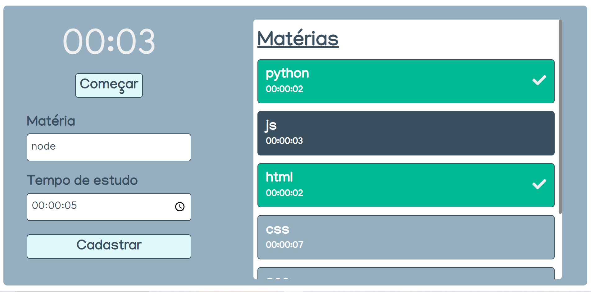

# Crono Studies




> Crono Studies é uma aplicação que permite o usuário cadastrar matérias de seu interesse e cronometrar o tempo de estudo. 

## Site em produção

Quem sabe faz ao vivo meu!

[Crono Studies](https://crono-studies.netlify.app/)

## 💻 Pré-requisitos

Antes de começar, verifique se você atendeu aos seguintes requisitos:

- Você possui o `Node Js` instalado em sua máquina?

## 🚀 Instalando Crono Studies

Para instalar o Crono Studies, siga estas etapas:

- Abra o terminal e navegue até a pasta do projeto e, depois:

```
npm install
```

## ☕ Usando Crono Studies

Para usar Crono Studies, siga estas etapas:

Na raiz do projeto, execute no terminal:

```
npm run start
```

Fique à vontade para contribuir!
